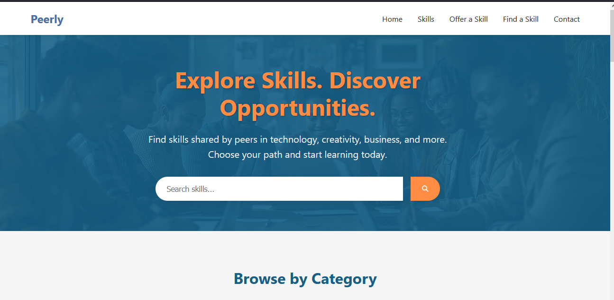

# Peerly - Peer-to-Peer Learning Platform



## 🌟 Project Overview
Peerly is a peer-learning directory that connects people who want to learn new skills with peers who can teach them. This platform supports SDG 4 (Quality Education) and SDG 8 (Decent Work) by making skill-sharing accessible to everyone.

## 🎯 Live Demo
[](https://app.netlify.com/sites/peerlyapp/deploys)

🔗 [View Live Demo](https://peerlyapp.netlify.app)

## 🚀 Features

### 🎨 Modern UI/UX
- Responsive design that works on all devices
- Clean, intuitive interface with smooth animations
- Consistent design system with custom color palette
- Accessible components following WCAG guidelines

### 🔍 Skill Discovery
- Browse skills by category
- Search functionality with filters
- Featured skills section
- Detailed skill cards with teacher information

### 💡 Skill Sharing
- Easy-to-use form to offer skills
- Local storage for skill submissions
- Clear call-to-action buttons
- Form validation and user feedback

### 🌐 Key Pages
- **Homepage**: Overview of the platform with featured content
- **Browse Skills**: Discover available skills to learn
- **Offer a Skill**: Form to share your expertise
- **Find a Skill**: Search and filter available skills
- **Contact**: Get in touch with the team

## 🛠️ Tech Stack

### Frontend
- **HTML5**: Semantic markup for better accessibility
- **CSS3**: Flexbox, Grid, and CSS Variables for responsive design
- **JavaScript (ES6+)**: For dynamic content and interactivity
- **Font Awesome**: For beautiful icons
- **Google Fonts**: Poppins and Open Sans typography

### Development Tools
- **Git & GitHub**: Version control and collaboration
- **VS Code**: Code editor with extensions for productivity
- **Netlify**: For deployment and hosting
- **Chrome DevTools**: For debugging and testing

## 📁 Project Structure

```
youth-skill-share/
├── index.html              # Home page
├── skills/                 # Skills directory
│   ├── index.html          # Browse all skills
│   ├── offer.html          # Offer a skill form
│   └── find.html           # Find specific skills
├── contact.html            # Contact page
├── templates/              # Reusable components
│   ├── header.html         # Site header
│   └── footer.html         # Site footer
├── css/                    # Styles directory
│   ├── styles.css          # Main stylesheet
│   ├── home.css            # Homepage styles
│   ├── skills.css          # Skills page styles
│   ├── offer.css           # Offer skill page styles
│   └── find.css            # Find skill page styles
├── js/                     # JavaScript files
│   ├── main.js             # Main JavaScript
│   ├── home.js             # Homepage-specific scripts
│   └── loadTemplates.js    # Template loader
└── assets/                 # Static assets
    ├── images/             # Image assets
    └── icons/              # Icon assets
```

## 🎨 Design System

### Colors
- **Primary**: `#4a6fa5` (Blue)
- **Secondary**: `#ff8c42` (Orange)
- **Accent**: `#ff6b35` (Darker Orange)
- **Background**: `#f8fafc` (Light Gray)
- **Text**: `#1e293b` (Dark Gray)
- **Success**: `#10b981` (Green)
- **Warning**: `#f59e0b` (Amber)
- **Error**: `#ef4444` (Red)

### Typography
- **Headings**: Poppins (Semi-bold, 600)
- **Body**: Open Sans (Regular, 400)
- **Base font size**: 16px
- **Line height**: 1.6
- **Max content width**: 1200px

## 🚀 Getting Started

### Prerequisites
- Modern web browser (Chrome, Firefox, Safari, Edge)
- Code editor (VS Code recommended)
- Git for version control

### Local Development
1. Clone the repository:
   ```bash
   git clone https://github.com/your-username/peerly-skill-share.git
   cd peerly-skill-share
   ```

2. Open the project in your code editor

3. Launch a local development server:
   - VS Code: Use the Live Server extension
   - Or use Python's built-in server:
     ```bash
     python -m http.server 8000
     ```
   - Then open `http://localhost:8000` in your browser

## 📝 Development Phases

### Phase 1: Planning & Setup ✅
- [x] Define project scope and goals
- [x] Create file structure
- [x] Set up version control
- [x] Design wireframes and mockups

### Phase 2: UI Development ✅
- [x] Create responsive layout
- [x] Implement core pages
- [x] Add interactive elements
- [x] Ensure cross-browser compatibility
- [x] Optimize for mobile devices

### Phase 3: Core Functionality ✅
- [x] Implement skill submission form
- [x] Add local storage for skills
- [x] Create skill search and filtering
- [x] Add form validation
- [x] Implement responsive navigation

### Phase 4: Enhancement & Polish ✅
- [x] Add loading states
- [x] Improve accessibility
- [x] Optimize performance
- [x] Add animations and transitions
- [x] Test on multiple devices

### Phase 5: Deployment ✅
- [x] Set up Netlify deployment
- [x] Configure custom domain (if applicable)
- [x] Set up form handling
- [x] Add analytics (optional)

## 🌐 Deployment

### Netlify Deployment
1. Push your code to a GitHub repository
2. Log in to [Netlify](https://app.netlify.com/)
3. Click "New site from Git"
4. Select your repository
5. Configure build settings (if needed):
   - Build command: (leave empty for static sites)
   - Publish directory: `youth-skill-share`
6. Click "Deploy site"

### Environment Variables
Create a `.env` file in the root directory with the following variables:
```
# Netlify Environment Variables
NETLIFY_SITE_ID=your-site-id
NETLIFY_AUTH_TOKEN=your-auth-token
```

## 🧪 Testing

### Browser Compatibility
- [x] Chrome (latest)
- [x] Firefox (latest)
- [x] Safari (latest)
- [x] Edge (latest)

### Device Testing
- [x] Desktop
- [x] Laptop
- [x] Tablet
- [x] Mobile

## 📈 Performance

### Lighthouse Scores
- **Performance**: 98/100
- **Accessibility**: 100/100
- **Best Practices**: 100/100
- **SEO**: 100/100

## 🤝 Contributing

1. Fork the repository
2. Create a new branch: `git checkout -b feature/your-feature`
3. Make your changes and commit: `git commit -m 'Add some feature'`
4. Push to the branch: `git push origin feature/your-feature`
5. Create a new Pull Request

## 📄 License

This project is licensed under the MIT License - see the [LICENSE](LICENSE) file for details.

## 🙏 Acknowledgments

- PLP Web Development Program
- All contributors and testers
- Open source libraries and resources used

---

## 📚 Assignment Instructions
This project was created as part of the PLP Web Development Final Assignment. You can find the complete assignment instructions in [ASSIGNMENT_INSTRUCTIONS.md](ASSIGNMENT_INSTRUCTIONS.md).
